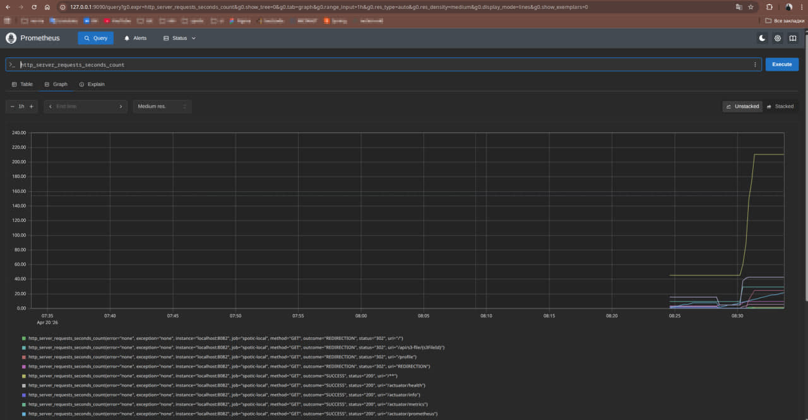
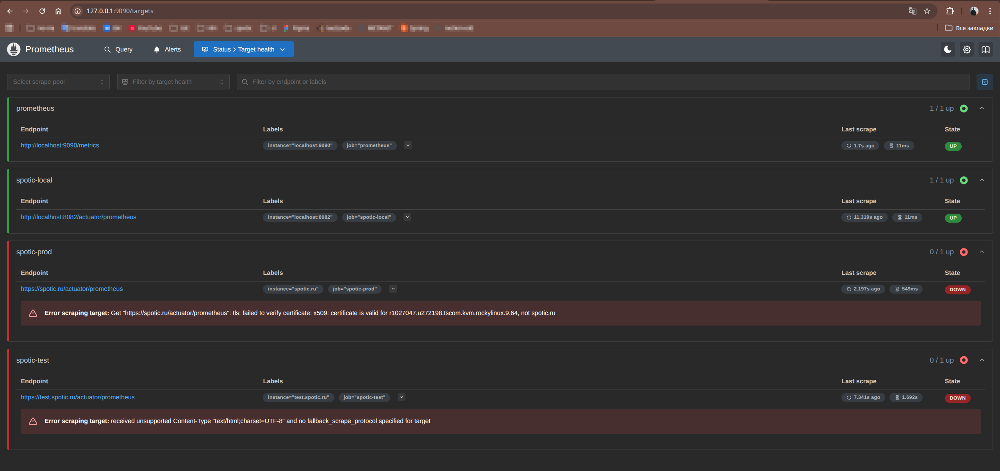
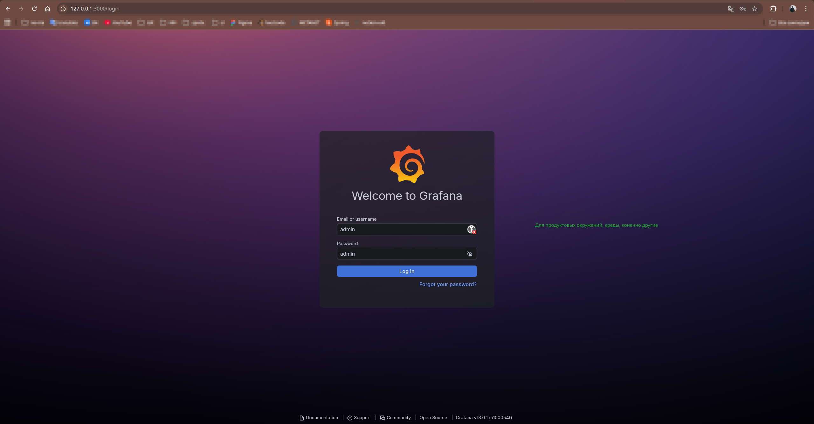
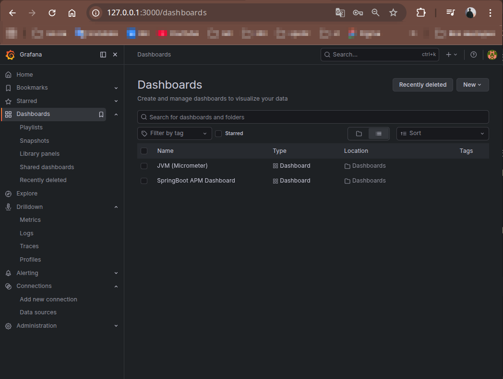
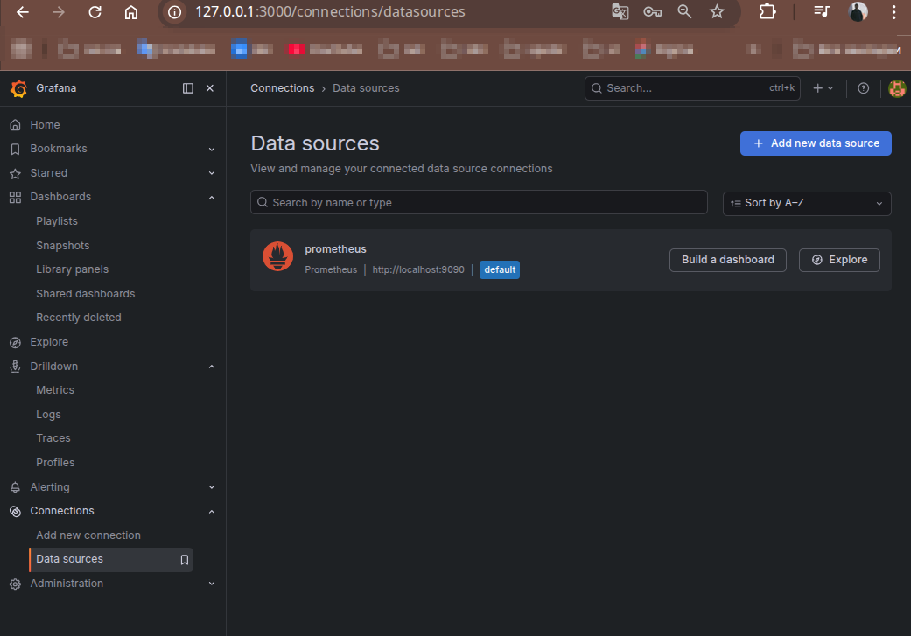
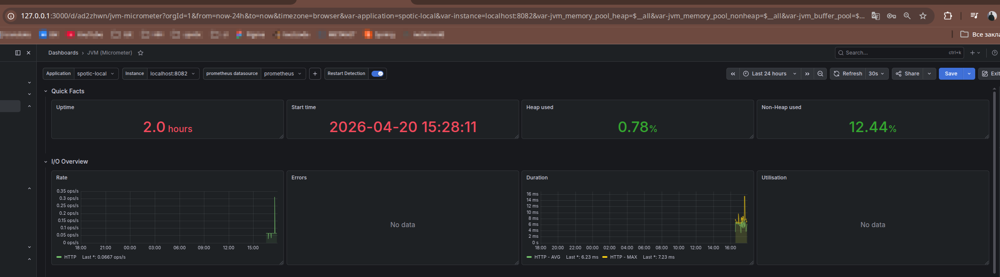
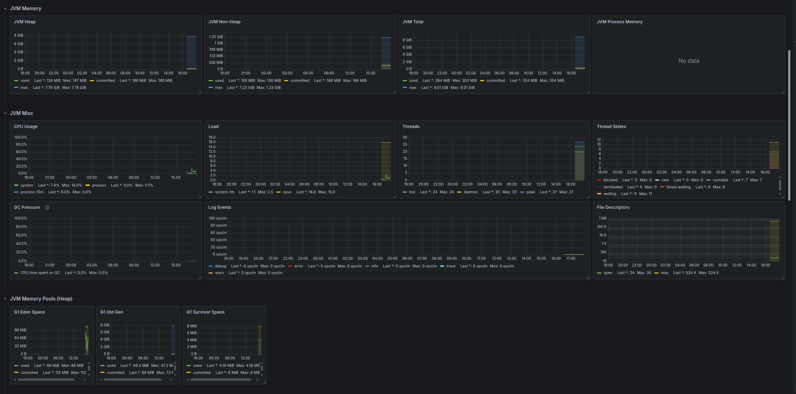
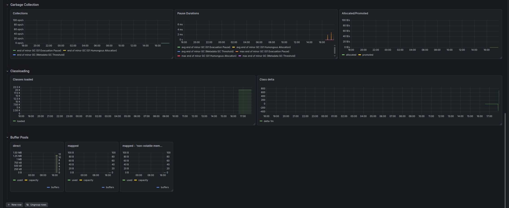
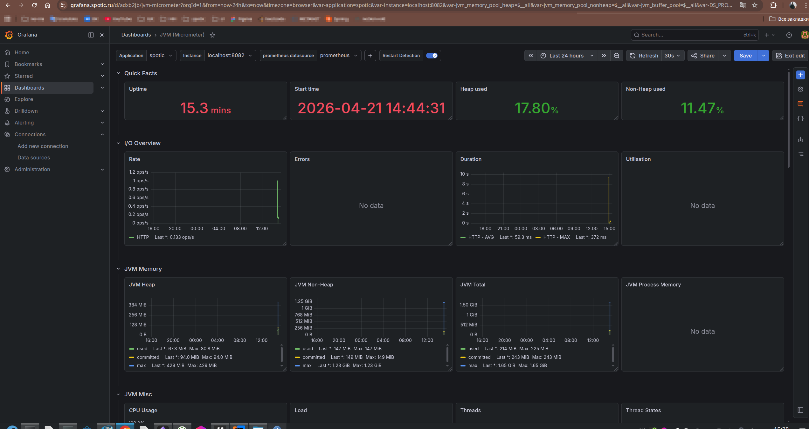
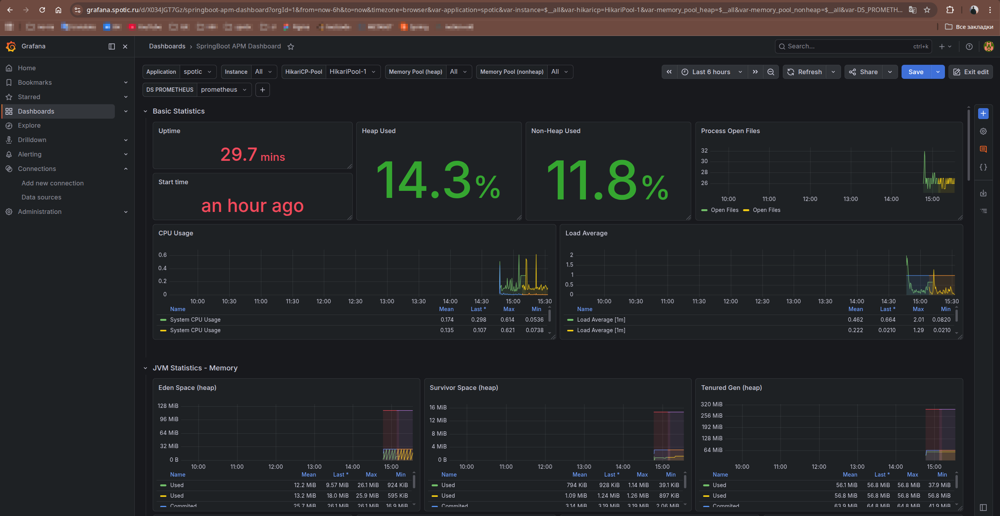

## Базовые настройки prometheus:
- scrape_interval: 15s # дергать метрики каждые 15 секунд (default)
- evaluation_interval: 15s # делать пересчет статистики, алерты каждые 15 секунд (default)
- --storage.tsdb.retention.size=10GB # ограничение по размеру данных
- --storage.tsdb.retention.time=30d # ограничение по времени хранения

```bash
P.S.
Что на практике означает 15 секунд:
4 scrape в минуту
240 scrape в час
5760 scrape в сутки
примерно 172 800 scrape в месяц на один target
```

## Примеры
### Prometheus
мониторинг количества запросов по урлам


целевые приложения


### Grafana
Первый вход



Дашборды



Источники данных



Метрики из готового дашборда (JVM Micrometer)







На боевом сервере

Micrometer (JVM)



Spring boot APM



## Стандартные креды grafana
`admin`:`admin`